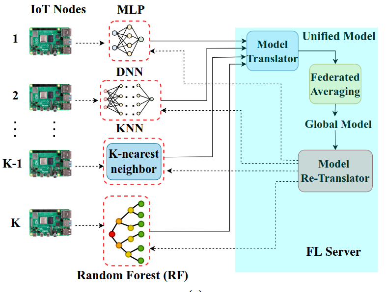
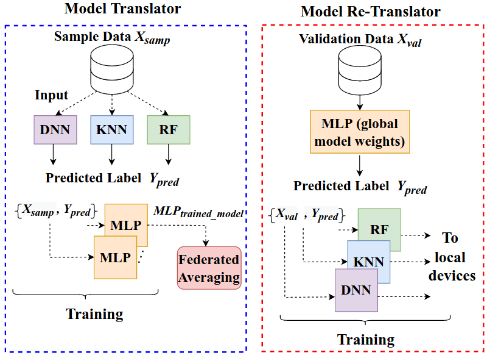

# **Federated Learning by elimination of Downstream Redundancy**

---
<!--_class: lead -->
## Problem of Central Model

- Central Model 🢩 Communication & Computation Bottleneck
- FL 🢩 Privacy Concerns

---
<!--_class: lead -->
## Solutions

- Homomorphic Encryption 🢩 Reduce Communication Costs
- Only Download a Subset of the weights

---
<!--_class: lead -->
# Homomorphic encryption

---

<!--_class: lead -->
Homomorphic encryption is a form of encryption which allows you to perform mathematical or logical operations on the encrypted data

---
Given two numbers $m_1$ and $m_2$, two ciphertexts $c_1$ and $c_2$ are obtained using some public encryption scheme $E_{pub}$.

$$
c_1 = E_{pub}(m_1) \qquad c_2 = E_{pub}(m_2)
$$
Additive homomorphic encryption specifically allows the addition of two encrypted values to yield an encrypted result that, when decrypted, is equal to the sum of the original values.

$$
D_{priv}(add_{pub}(E_{pub}(m_1),E_{pub}(m_2))) = m_1 + m_2
$$

Fully homomorphic encryption schemes  support arbitrary computations on encrypted data.

---

# Paillier Encryption

 - Paillier is a type of public-key cryptosystem that supports additive homomorphic encryption.
 - Invented by Pascal Paillier in 1999, it is a partial homomorphic encryption scheme which allows two types of computation:

    * addition of two ciphertexts
    * multiplication of a ciphertext by a plaintext number

--- 

# Homomorphic properties

#### Addition of two ciphertexts
When two ciphertexts are multiplied, the result decrypts to the sum of their plaintexts:
$$
D_{priv}(E_{pub}(m_1)⋅E_{pub}(m_2)\quad mod\enspace n^2)=m_1+m_2\quad mod\enspace n
$$
#### Multiplication of a ciphertext by a plaintext
When a ciphertext is raised to the power of a plaintext, the result decrypts to the product of the two plaintexts:
$$
D_{priv}(E_{pub}(m_1)^{m_2} \quad mod\enspace n^2)=m_1⋅m_2 \quad mod\enspace n
$$
---

<!--_class: lead -->
# Federated Learning with Heterogeneous Models
for On-device Malware Detection in IoT Networks

---

---

---

# Conclusion
* The paper evaluates the impact of heterogeneity in the distribution of ML models on the proposed FL framework.
* Proposed framework has 1.63× faster-testing latency in comparison to traditional FL.
* The performance metrics reported illustrate that the proposed FL framework attains a performance elevation of 7% to 13% than traditional FL in terms of accuracy, TPR, and TNR.
* Despite including a variable number of heterogeneous models, the technique achieves high malware detection performance with 90% to 96% accuracy and 3% to 5% FPR
---
<!--_class: lead -->
# Distributed Machine Learning
# vs
# Federated Machine Learning
---
## Quick Takeaways
* Distributed machine learning (DL) is a multinode approach that improves performance and accuracy on large data sets.
* Federated learning (FL) is a decentralized approach that preserves privacy and relevance on local data sets.
* FL does not share raw data, uses encryption, and works across different locations or businesses. DL does not have these features.

---
## Distributed Machine Learning

The distributed machine learning algorithm creates training models using independent training on various nodes. The training on enormous amounts of data is accelerated by using a distributed training system. Scalability and online re-training are necessary because training time grows exponentially 
when using big data.

---
## Federated Machine Learning 

Federated learning utilizes methods from numerous fields of study, including distributed systems, machine learning, and privacy. It works best when on-device data is more pertinent than data stored on servers. Federated learning offers cutting-edge ML to edge devices without by default centralized data and privacy. It manages the unbalanced, non-Independent, and Identically Distributed (IID) data of the features in mobile devices.

---
## Significant Differences

* FL prohibits the transmission of direct raw data. Such a limitation does not apply to DL.
* FL typically makes use of encryption or other defensive strategies to guarantee privacy. FL assures that the raw data’s security and confidentiality will be maintained. In DL, safety is not as heavily emphasized.
* Federated learning makes use of methods from a variety of fields of study, including distributed systems, machine learning, and privacy.

---
# Websites
- [Building Multilayer Perceptron Models in PyTorch](https://machinelearningmastery.com/building-multilayer-perceptron-models-in-pytorch/)
- [Three Ways to Build a Neural Network in PyTorch](https://towardsdatascience.com/three-ways-to-build-a-neural-network-in-pytorch-8cea49f9a61a)
- [Example: Walk-Through PyTorch & MNIST](https://flower.dev/docs/example-walkthrough-pytorch-mnist.html)
- [Example: PyTorch - From Centralized To Federated](https://flower.dev/docs/example-pytorch-from-centralized-to-federated.html)
- [DEEP LEARNING -> FEDERATED LEARNING IN 10 LINES OF PYTORCH + PYSYFT](https://blog.openmined.org/upgrade-to-federated-learning-in-10-lines/)
- [Federated Learning: Collaborative Machine Learning with a Tutorial on How to Get Started](https://becominghuman.ai/federated-learning-collaborative-machine-learning-with-a-tutorial-on-how-to-get-started-2e7d286a204e)
- [Preserving Data Privacy in Deep Learning | Part 1](https://towardsdatascience.com/preserving-data-privacy-in-deep-learning-part-1-a04894f78029)

---

# Papers

- [Deep, Big, Simple Neural Nets for Handwritten Digit Recognition](https://doi.org/10.1162/NECO_a_00052)
- [Communication-Efficient Learning of Deep Networks from Decentralized Data](https://doi.org/10.48550/arXiv.1602.05629)
- [A PyTorch Implementation of Federated Learning](https://doi.org/10.5281/zenodo.4321561)

---

# Repositories & Notebooks

- [Federated learning: basic concepts](https://developers.sherpa.ai/tutorials/flexibility-and-scalability/model/pytorch)
- [Federated Learning (PyTorch)](https://www.kaggle.com/code/puru98/federated-learning-pytorch)
- [Federated-Learning (PyTorch)](https://github.com/AshwinRJ/Federated-Learning-PyTorch)
- [Federated Learning](https://github.com/shaoxiongji/federated-learning)

--- 
<!--_class: lead -->
# Encryption Schemes

---

# Paper 1

- Clients holds a private key
- Server collects Public keys
- Client decrypts model for training
- Client encrypts weights for update
- Server operates on weights to average

---

# Medical Fed Lern

- Server holds a private key
- Hospital clients are given the public key

# Steps:

- Hospital 1 computes its gradient & encrypts it
- Hospital 2 receives it, cumputes its gradient and sums it to Hospital 1
- hospital 3 does the same and passes the overall sum to the
server. 
- The server obtains the gradient of the whole (virtual) training set;
decrypts it and sends the gradient back to every client.
- The clients then update their respective local models.

---
